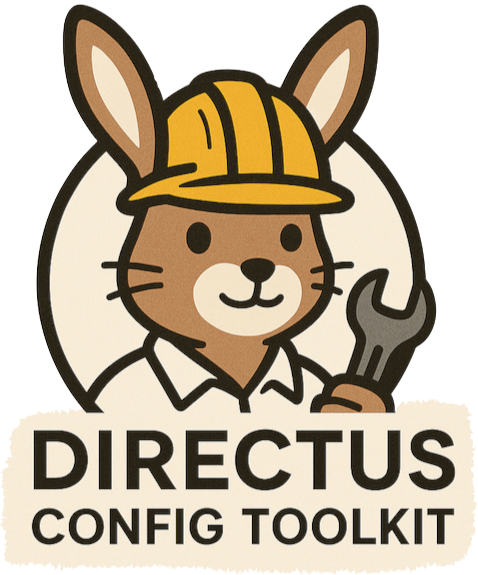

#  Directus Config Toolkit UI

This package provides the web dashboard for the Directus Config Toolkit (DCT), offering a modern, intuitive interface for managing Directus configurations across environments.

---

## Features

- Visual configuration management for Directus
- Import/export with change previews
- Time machine for configuration history
- Role & permission management
- Audit log browsing
- Docker & CI/CD friendly

---

## Getting Started

### Prerequisites

- Node.js v18 or higher
- npm or yarn
- A running Directus instance (for full functionality)

### Setup & Development

1. **Install dependencies (from monorepo root):**
   ```bash
   npm install
   ```
2. **Start the development server:**
   ```bash
   npm run dev
   # or, from this directory:
   cd packages/ui
   npm run dev
   ```
3. Open [http://localhost:3000](http://localhost:3000) in your browser.

---

## Building for Production

To build the UI for production:

```bash
npm run build
# or, from this directory:
cd packages/ui
npm run build
```

---

## Environment Variables

Set these variables to configure the UI:

- `DCT_API_URL`: URL of your Directus instance (required)
- `DCT_TOKEN`: Directus API token (required)
- `DCT_CONFIG_PATH`: Path to config files (default: `./config`)
- `AUTH_SECRET`: Secret for NextAuth (required for authentication)
- `AUTH_TRUST_HOST`: Set to `true` if you encounter untrusted host issues
- `DCT_UI_URL`: Public URL of the UI (optional)
- `DCT_UI_USERNAME` / `DCT_UI_PASSWORD`: Credentials for UI login (password should be a bcrypt hash)

You can use a `.env` file or pass these variables directly.

---

## Docker Usage

Build and run the UI dashboard with Docker:

```bash
docker build -t directus-config-toolkit-ui .

docker run -p 3000:3000 \
  -e DCT_API_URL=http://directus:8055 \
  -e DCT_TOKEN=your_token \
  -v $(pwd)/config:/app/config \
  directus-config-toolkit-ui
```

---

## Project Structure

- `src/` – Next.js app source code
- `public/` – Static assets
- `middleware.ts` – Next.js middleware
- `next.config.ts` – Next.js configuration

---

## Contributing

We welcome contributions! To get started:

1. Fork the repository and create a new branch.
2. Follow the setup instructions above.
3. Make your changes and ensure the UI works as expected.
4. Submit a pull request with a clear description.

---

## Learn More

- [Main Project README](../../README.md)
- [Directus Documentation](https://docs.directus.io)
- [Next.js Documentation](https://nextjs.org/docs)

---

Happy coding! 🚀
